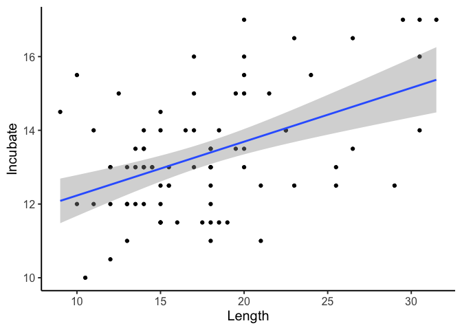
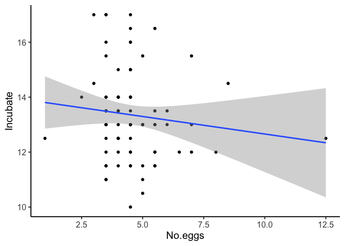
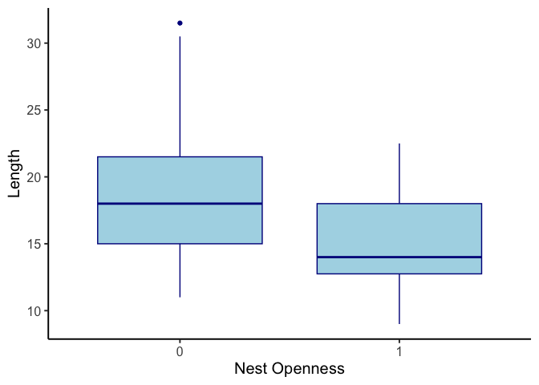
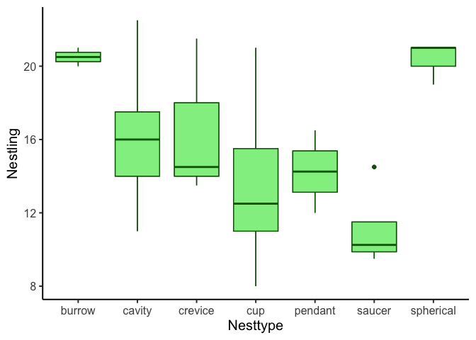
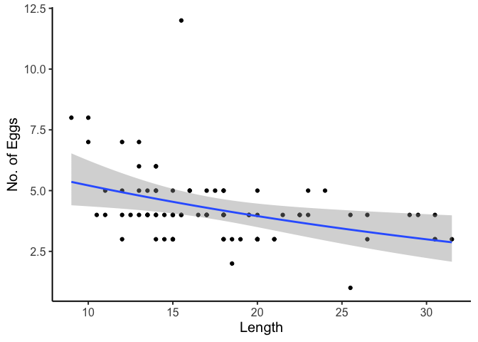
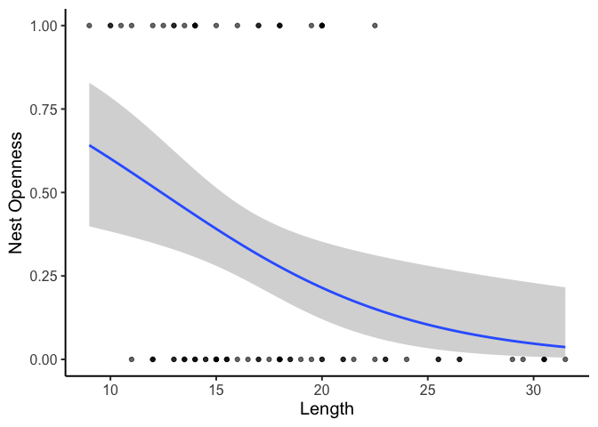

Data \> Analysis \> Visuals
================
Steve Midway
2025-02-26

## Data

Knowing your data type(s) is critically important to both understanding
what raw materials you have to work with, but also what models are
possible given your data.

### Types of Data

| Data Type | Variable Type | Description | Example |
|----|----|----|----|
| Numeric | Continuous | -∞ to ∞<br> Decimals | -4 C<br> 0.56 mL<br> 1622.1 grams |
| Numeric | Integer | 0 to ∞<br> Counts | 0 zombies<br> 5 redfish<br> 610 bluefish |
| Character | Factor<br> Categorical | Letters<br> Words | Barataria Bay<br> Medium<br> Dislike |

## Analysis

### Objective of a Model

- Response = predictor (+ errors)
- $y = x$
- Example: Plant height = fertilizer + water

**The model needs to represent the question!**

### Some Models

| Response Type | Predictor Type | Model Name | R Syntax |
|:--:|:--:|:--:|:--:|
| Continuous | Continuous | Simple Linear Regression | `lm(y ~ x, data = df)` |
| Continuous | Continuous (2+ variables) | Multiple Linear Regression | `lm(y ~ x1 + x2, data = df)` |
| Continuous | Categorical (2 groups) | *t*-test | `t.test(y ~ group, data = df)` |
| Continuous | Categorical (3+ groups) | ANOVA | `aov(y ~ factor, data = df)` |
| Count | Continuous, Categorical | Poisson Regression (GLM) | `glm(y ~ x, family = poisson, data = df)` |
| Binary (0/1) | Continuous, Categorical | Binomial (Logistic) Regression (GLM) | `glm(y ~ x, family = binomial, data = df)` |
| Interval (0 to 1) | Continuous, Categorical | Beta Regression | `betareg(y ~ x, data = df)` |

## Visuals

To see examples of appropriate and effective visuals for types of data
and models, let’s use the `BirdNest` data in the `Stat2Data` library. We
also need to load `ggplot2`, which we will do through the `tidyverse`
package.

``` r
library(tidyverse)
library(Stat2Data)
data(BirdNest)
```

### The Data

``` r
head(BirdNest)
```

    ##                     Species                     Common Page Length Nesttype
    ## 1         Tyrannus tyrannus           Eastern Kingbird  360   20.0      cup
    ## 2 Myiodynastes luteiventris Sulphur-bellied Flycatcher  368   20.0   cavity
    ## 3     Myiarchus cinerascens     Ash-thoated Flycatcher  372   20.0   cavity
    ## 4      Myiarchus tyrannulus   Brown-crested Flycatcher  372   22.5   cavity
    ## 5     Myarchus tuberculifer    Dusky-capped Flycatcher  374   17.0   cavity
    ## 6           Sayornis phoebe             Eastern Phoebe  378   17.0      cup
    ##   Location No.eggs Color Incubate Nestling Totcare Closed.
    ## 1    decid     3.5     1     17.0     17.0    34.0       0
    ## 2    decid     3.5     1     15.5     17.0    32.5       1
    ## 3    decid     4.5     1     15.0     15.0    30.0       1
    ## 4    decid     4.5     1     14.0     16.5    30.5       1
    ## 5    decid     4.5     1     14.0     14.0    28.0       1
    ## 6   bridge     4.5     0     16.0     15.5    31.5       0

See the data descriptor for details about the variable names and
measurement units. For our examples, we will use the following
variables, listed by type below.

**Continuous**

- Length
- Incubate
- Nestling

**Count**

- No.eggs

**Binary**

- Color

**Categorical**

- Closed (2 groups)
- Location (3+ groups)

### Simple Linear Regression

**Question**: *Does bird body length predict incubation time?* (Could
phrase more specifically, such as: *Do larger birds have longer
incubation times?*, or whatever the specific hypothesis of interest is.)

``` r
summary(lm(Incubate ~ Length, data = BirdNest))
```

    ## 
    ## Call:
    ## lm(formula = Incubate ~ Length, data = BirdNest)
    ## 
    ## Residuals:
    ##     Min      1Q  Median      3Q     Max 
    ## -2.8376 -1.0511 -0.0566  0.9290  3.3084 
    ## 
    ## Coefficients:
    ##             Estimate Std. Error t value Pr(>|t|)    
    ## (Intercept) 10.77130    0.55348  19.461  < 2e-16 ***
    ## Length       0.14601    0.03005   4.859 5.67e-06 ***
    ## ---
    ## Signif. codes:  0 '***' 0.001 '**' 0.01 '*' 0.05 '.' 0.1 ' ' 1
    ## 
    ## Residual standard error: 1.436 on 81 degrees of freedom
    ##   (1 observation deleted due to missingness)
    ## Multiple R-squared:  0.2257, Adjusted R-squared:  0.2162 
    ## F-statistic: 23.61 on 1 and 81 DF,  p-value: 5.669e-06

**Visual**

``` r
ggplot(BirdNest, aes( y = Incubate, x = Length)) +
  geom_point() +
  geom_smooth(method = "lm") +
  theme_classic(base_size = 15)
```

<!-- -->

### Multiple Linear Regression

**Question**: *Does bird body length and number of eggs predict
incubation time?* (Again, you are encouraged to think of a more
specific, directional hypothesis.)

``` r
summary(lm(Incubate ~ Length + No.eggs, data = BirdNest))
```

    ## 
    ## Call:
    ## lm(formula = Incubate ~ Length + No.eggs, data = BirdNest)
    ## 
    ## Residuals:
    ##     Min      1Q  Median      3Q     Max 
    ## -2.7702 -1.1883 -0.0504  0.9718  3.3856 
    ## 
    ## Coefficients:
    ##             Estimate Std. Error t value Pr(>|t|)    
    ## (Intercept) 10.17250    0.94911  10.718  < 2e-16 ***
    ## Length       0.15583    0.03266   4.771 8.12e-06 ***
    ## No.eggs      0.09292    0.11950   0.778    0.439    
    ## ---
    ## Signif. codes:  0 '***' 0.001 '**' 0.01 '*' 0.05 '.' 0.1 ' ' 1
    ## 
    ## Residual standard error: 1.44 on 80 degrees of freedom
    ##   (1 observation deleted due to missingness)
    ## Multiple R-squared:  0.2315, Adjusted R-squared:  0.2123 
    ## F-statistic: 12.05 on 2 and 80 DF,  p-value: 2.661e-05

**Visual**

``` r
ggplot(BirdNest, aes( y = Incubate, x = Length)) +
  geom_point() +
  geom_smooth(method = "lm") +
  theme_classic(base_size = 15)
```

<!-- -->

``` r
ggplot(BirdNest, aes( y = Incubate, x = No.eggs)) +
  geom_point() +
  geom_smooth(method = "lm") +
  theme_classic(base_size = 15)
```

<!-- -->

### *t*-test

**Question**: *Is there a (significant) difference in bird size based on
nest openness?*

``` r
t.test(Length ~ as.factor(Closed.), data = BirdNest)
```

    ## 
    ##  Welch Two Sample t-test
    ## 
    ## data:  Length by as.factor(Closed.)
    ## t = 3.4489, df = 71.761, p-value = 0.0009459
    ## alternative hypothesis: true difference in means between group 0 and group 1 is not equal to 0
    ## 95 percent confidence interval:
    ##  1.490037 5.572341
    ## sample estimates:
    ## mean in group 0 mean in group 1 
    ##        18.77193        15.24074

**Visual**

``` r
ggplot(BirdNest, aes( y = Length, x = as.factor(Closed.))) +
  geom_boxplot(fill = "lightblue", col = "darkblue") +
  labs(x = "Nest Openness") +
  theme_classic(base_size = 15)
```

<!-- -->

### ANOVA (ANalysis Of VAriance)

**Question**: *Is there a (significant) difference in parental care by
nest type?*

``` r
aov_model <- aov(Nestling ~ Nesttype, data = BirdNest)
summary(aov_model)
```

    ##             Df Sum Sq Mean Sq F value   Pr(>F)    
    ## Nesttype     6  339.1   56.51   5.167 0.000164 ***
    ## Residuals   77  842.1   10.94                     
    ## ---
    ## Signif. codes:  0 '***' 0.001 '**' 0.01 '*' 0.05 '.' 0.1 ' ' 1

Yes, there is, so we need something like a Tukey’s post hoc comparisons
test to determine which groups differ from each other.

``` r
mult_comp <- TukeyHSD(aov_model)
sort(mult_comp$Nesttype[,4])
```

    ##  spherical-saucer     spherical-cup     saucer-burrow        cup-cavity 
    ##       0.008395074       0.012914752       0.025541207       0.055640400 
    ##        cup-burrow     saucer-cavity    saucer-crevice spherical-pendant 
    ##       0.059848522       0.096443208       0.347113542       0.413863785 
    ##  spherical-cavity    pendant-burrow     cavity-burrow       cup-crevice 
    ##       0.427494203       0.493179481       0.593816405       0.712270092 
    ## spherical-crevice        saucer-cup    crevice-burrow    saucer-pendant 
    ##       0.789623755       0.822191233       0.838167537       0.928902550 
    ##    pendant-cavity   pendant-crevice       pendant-cup    crevice-cavity 
    ##       0.985186193       0.989156481       0.999880284       0.999999255 
    ##  spherical-burrow 
    ##       0.999999997

**Visual**

``` r
ggplot(BirdNest, aes(y = Nestling, x = Nesttype)) +
  geom_boxplot() +
  geom_boxplot(fill = "lightgreen", col = "darkgreen") +
  theme_classic(base_size = 15)
```

<!-- -->

### Poisson Regression

**Question**: *Do larger birds have fewer eggs?*

``` r
# Eggs are an average, so let's transform them to an integer
BirdNest$No.eggs.int <- as.integer(BirdNest$No.eggs)

summary(glm(No.eggs.int ~ Length, 
    family = 'poisson', data = BirdNest))
```

    ## 
    ## Call:
    ## glm(formula = No.eggs.int ~ Length, family = "poisson", data = BirdNest)
    ## 
    ## Coefficients:
    ##             Estimate Std. Error z value Pr(>|z|)    
    ## (Intercept)  1.92812    0.19106  10.092   <2e-16 ***
    ## Length      -0.02769    0.01084  -2.554   0.0107 *  
    ## ---
    ## Signif. codes:  0 '***' 0.001 '**' 0.01 '*' 0.05 '.' 0.1 ' ' 1
    ## 
    ## (Dispersion parameter for poisson family taken to be 1)
    ## 
    ##     Null deviance: 36.874  on 83  degrees of freedom
    ## Residual deviance: 30.041  on 82  degrees of freedom
    ## AIC: 309.62
    ## 
    ## Number of Fisher Scoring iterations: 4

**Visual**

``` r
ggplot(BirdNest, aes(y = No.eggs.int, x = Length)) +
  geom_point() +
  geom_smooth(method = "glm", 
              method.args = list(family = "poisson")) +
  labs(y = "No. of Eggs") +
  theme_classic(base_size = 15)
```

<!-- -->

### Logistic Regression

**Question**: *Do larger birds have more open nests?*

``` r
summary(glm(Closed. ~ Length, 
    family = 'binomial', data = BirdNest))
```

    ## 
    ## Call:
    ## glm(formula = Closed. ~ Length, family = "binomial", data = BirdNest)
    ## 
    ## Coefficients:
    ##             Estimate Std. Error z value Pr(>|z|)   
    ## (Intercept)  2.12025    1.03957   2.040   0.0414 * 
    ## Length      -0.17090    0.06303  -2.712   0.0067 **
    ## ---
    ## Signif. codes:  0 '***' 0.001 '**' 0.01 '*' 0.05 '.' 0.1 ' ' 1
    ## 
    ## (Dispersion parameter for binomial family taken to be 1)
    ## 
    ##     Null deviance: 105.49  on 83  degrees of freedom
    ## Residual deviance:  95.71  on 82  degrees of freedom
    ## AIC: 99.71
    ## 
    ## Number of Fisher Scoring iterations: 4

**Visual**

``` r
ggplot(BirdNest, aes(y = Closed., x = Length)) +
  geom_point(alpha = 0.6) +
  geom_smooth(method = "glm", 
              method.args = list(family = "binomial")) +
  labs(y = "Nest Openness") +
  theme_classic(base_size = 15)
```

<!-- -->
