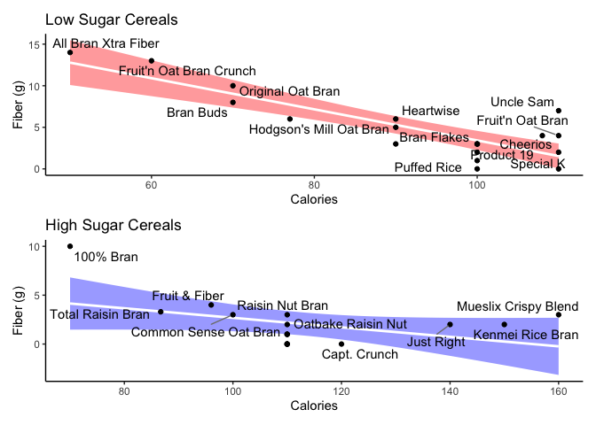

Assignment 3: ggplotting
================
DAR Lab
Spring 2025

### Reverse Engineering Plots

*Recreate the following three figures and show your code. For full
credit, please recreate all aspects of the figure, including color and
labels. In other words, your end product should be an exact replicate of
the figures below.*

1.  In the `Stat2Data` library use the `Hawks` dataset to created a
    (faceted) plot of hawk wing and weight. Each year should be its own
    panel, and within each panel color the points by the different
    species of hawk.

<!-- -->

2.  Also in the `Stat2Data` library is the `FGByDistance` dataset. Use
    this data to first manipulate the data into groups of \<20, 20-30,
    30-40, 40-50, and 50+ distance (attempts). Then, create a bar plot
    (`geom_col()`) to plot the percent of field goals made by the
    distance groups.

<!-- -->

3.  Use the `Cereal` data in the `Stat2Data` library. Split the data up
    into low and high sugar groups, with 5 grams or less being the
    criteria for low sugar. Note that I have not faceted these panels; I
    created separate plots and used `patchwork` to create the layout.
    The `ggrepel` library and `geom_text_repel` function can be used to
    label the points as shown below. (Note that when labeled in this way
    you don’t have total control over the placement of the labels, so
    the labels are one thing you don’t need to worry about recreating
    exactly.)

<!-- -->

### Your Assignment

Compile all your work (code and plots) into an html file and upload to
Moodle by **5pm Monday, February 24, 2025**.
