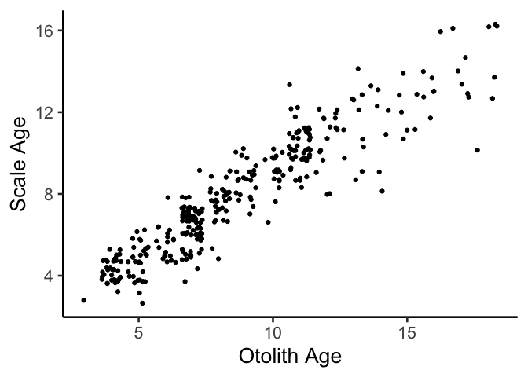
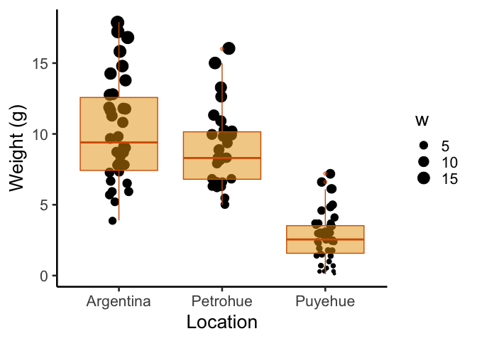
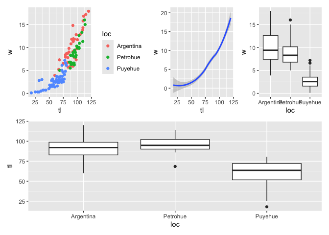
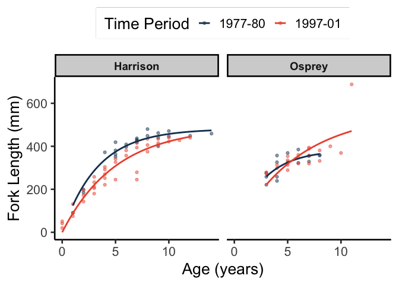

`ggplot2`: The Basics
================
Steve Midway
2024-02-20

# gg? The Grammar of Graphics

- Leland Wilkinson, “The Grammar of Graphics” (1999)
- Not about plotting, but about the theory of graphics
- Not `ggplot`, but describes the system that underlies ggplot and other
  graphical programs


# The Mentality

<div class="figure" style="text-align: center">


<p class="caption">
We tend to think top down about a graphic
</p>

</div>

<div class="figure" style="text-align: center">


<p class="caption">
The gg approach is to think bottom up about the ingredients of a graphic
</p>

</div>

# The In`gg`redients

### 1. Data

- Tidy format: variables are columns, observations are rows

### 2. Geometries

- Graphical representations of points, lines, polygons, etc.
- Geometries describe the shapes that we typically associate with the
  plot (a point geometry might be a scatterplot, a bar (polygon) might
  be a bar chart or histogram, etc.)

### 3. Statistics

- May need to display something beyond the raw data; summary statistics
  to models

### 4. Facets

- Splits graphics into panels (small multiples)

### 5. Coordinates

- Like scales, but think scales apply to data, while coordinates apply
  to the plotting surface or layout
- The coordinates interpret the variables that are mapped, scaled, and
  adopt a geometry
- Again, don’t think about spatial coordinate or maps exclusively

### 6. Themes

- The look of the plot that is not related to the data; background
  color, font sizes, etc.
- The most disconnected of the ingredients

### 7. Scales

- Translates variables ranges to property ranges (e.g., category is
  color); imply discrete or continuous nature of data

### 8. Mapping

- Not spatial mapping–linking variables in data to representations or
  aesthetics

### 9. Aesthetics

- Theoretically, aesthetics are an important part of any plot, but
  practically, aesthetics are build into multiple levels; i.e., not a
  “layer” unto itself

# Obvious, but Important

`ggplot2` is the package in R that adopts the grammar of graphic in a
specific way to create plots.

In `ggplot2` many of the ingredients have defaults. Some do not.


# Expand your \[Tidy\]verse


# The `ggplot` Recipe

### Global data and mapping

- we need the `ggplot()` function and then we add to it
- Here, the data and *x* and *y* variables are mapped globally
- `geom_point()` adopts the global data and plots the points

``` r
library(tidyverse)
library(FSA)
ggplot(data = ChinookArg,
       mapping = aes(x = tl, y = w)) +
  geom_point()
```

<!-- -->

- We may or may not specify the lefthand side of the arguments
- This code is the same as on the previous slide; it is more efficient,
  but also riskier if you are not familiar with arguments and argument
  order

``` r
ggplot(ChinookArg, aes(x = tl, y = w)) +
  geom_point()
```

<!-- -->

### Global data and local mapping

- This code is different, but produces the same plat as above
- Here we have specified *global data*, but local mapping
- An additional layer (e.g., `geom`) will not adopt the same *x* and *y*
  and needs to be specified

``` r
ggplot(data = ChinookArg) +
    geom_point(mapping = aes(x = tl, y = w))
```

<!-- -->

### Local data and local mapping

- This code is different, but produces the same plat as above
- Here nothing is global; data and mapping are local (layer-specific)
- An additional layer (e.g., `geom`) will need data and mapping

``` r
ggplot() +
    geom_point(data = ChinookArg,
               mapping = aes(x = tl, y = w))
```

<!-- -->

# Some Comments

- Note the differences in the previous codes, but not in the plots;
  sometimes different code can produce the same graphic

- But as graphics get more complex, these small differences will mean
  more in terms of what you are able to do

- As with many functions in R, we get lazy/efficient and don’t specify
  the left side of the argument, which is shown here…

- But as you can see, these three examples with even less code could be
  more confusing

- We can also assign a `ggplot` to an object, which might be necessary
  later

``` r
p <- ggplot() +
        geom_point(data = ChinookArg,
               mapping = aes(x = tl, y = w))
```

# Themes (and Labels)

Normally we would deal with themes later, but because we want larger
axes labels and other improvements, let’s cover themes now.

There are built-in themes available in `ggplot`

``` r
ggplot(data = ChinookArg) +
    geom_point(mapping = aes(x = tl, y = w)) +
  theme_bw() 
```

<!-- -->

Let’s play with themes to make some major aesthetic changes.

- There are a lot of built in themes, and not all will be shown here

``` r
ggplot(data = ChinookArg) +
    geom_point(mapping = aes(x = tl, y = w)) +
  theme_dark() 
```

<!-- -->

``` r
ggplot(data = ChinookArg) +
    geom_point(mapping = aes(x = tl, y = w)) +
  theme_classic() 
```

<!-- -->

- Classic is a nice theme, now let’s bump up the sizes

- Also, a legend on the side is usually fine, but let’s move it to the
  top and put a box around it

``` r
ggplot(data = ChinookArg) +
    geom_point(mapping = aes(x = tl, y = w)) +
  labs(x = "Total Length (mm)",  
       y = "Weight (g)") + 
  theme_classic(base_size = 20) 
```

<!-- -->

# `ggthemes`

The library `ggthemes` has a lot of pre-baked themes to try!

``` r
library(ggthemes)
ggplot(data = ChinookArg) +
    geom_point(mapping = aes(x = tl, y = w)) +
  labs(x = "Total Length (mm)",  
       y = "Weight (g)") + 
  theme_classic(base_size = 20) +
  theme_wsj() 
```

<!-- -->

``` r
ggplot(data = ChinookArg) +
    geom_point(mapping = aes(x = tl, y = w)) +
  labs(x = "Total Length (mm)",  
       y = "Weight (g)") + 
  theme_classic(base_size = 20) +
  theme_economist() 
```

<!-- -->

``` r
ggplot(data = ChinookArg) +
    geom_point(mapping = aes(x = tl, y = w)) +
  labs(x = "Total Length (mm)",  
       y = "Weight (g)") + 
  theme_classic(base_size = 20) +
  theme_excel()  
```

<!-- -->

# `geoms`

- `geoms` are the function that specify the plot geometry, more commonly
  thought of as the plot type.
- Geometries can be points, lines, or polygons, but typically specific
  by their more common name (e.g., `geom_bar()`)
- Note that some `geoms` simply plot the data, while others summarize
  the data!

``` r
ggplot(data = ChinookArg) +
    geom_point(mapping = aes(x = tl, y = w)) + 
  labs(x = "Total Length (mm)",  
       y = "Weight (g)") + 
  theme_classic(base_size = 20)
```

<!-- -->

- But sometimes points overlap…

``` r
library(FSAdata)
ggplot(data = StripedBass1) +
    geom_point(mapping = aes(x = ageO, y = ageS)) + 
  labs(x = "Otolith Age",  
       y = "Scale Age") + 
  theme_classic(base_size = 20)
```

<!-- -->

- Often you may want to jitter

``` r
ggplot(data = StripedBass1) +
    geom_jitter(mapping = aes(x = ageO, y = ageS)) + 
  labs(x = "Otolith Age",  
       y = "Scale Age") + 
  theme_classic(base_size = 20)
```

<!-- -->

# `geoms_boxplot()`

``` r
ggplot(data = ChinookArg) +
    geom_boxplot(mapping = aes(x = loc, y = tl)) + 
  labs(x = "Location",  
       y = "Weight (g)") + 
  theme_classic(base_size = 20)
```

<!-- -->

# `geom_histogram()`

``` r
ggplot(data = ChinookArg) +
    geom_histogram(mapping = aes(x = w), bins = 12) + 
  labs(x = "Weight (g)",  
       y = "Count") + 
  theme_classic(base_size = 20)
```

<!-- -->

# `geom_density()`

``` r
ggplot(data = ChinookArg) +
    geom_density(mapping = aes(x = tl), fill = "gray") + 
  labs(x = "Total Length (mm)",  
       y = "Density") + 
  theme_classic(base_size = 20)
```

<!-- -->

# Multiple `geoms`

- Multiple geoms can be added when they are different factors of the
  same variable

``` r
ggplot(data = ChinookArg) +
    geom_density(aes(x = tl, fill = loc), alpha = 0.5) + 
  labs(x = "Total Length (mm)",  
       y = "Density") + 
  theme_classic(base_size = 20)
```

<!-- -->

# Multiple `geoms`

- Multiple geoms can be added when they are different variables or
  different treatments of the same variable

``` r
ggplot(data = ChinookArg) +
    geom_point(aes(x = tl, y = w, color = loc)) + 
  geom_smooth(method = "lm", 
              aes(x = tl, y = w, 
                color = loc, fill = loc)) + 
  labs(x = "Total Length (mm)",  
       y = "Weight (g)") + 
  theme_classic(base_size = 20)
```

<!-- -->

# Statistics

- Each geom has its own options for statistics and you will typically
  just need the default statistic
- For example, `geom_boxplot()` defaults to calculate all the statistics
  included in a box plot
- But other statistics can be added
- Recommendation: focus on the geom you want and then look into the
  statistics, if you need them

# Scales

- Scales control the mapping of data to aesthetics
- Scales turn data into a visual, like color, size, shape, etc.
- Manipulating data into visuals can be one of the harder things to do
  in `ggplot`, but it also one of the most rewarding parts and one that
  will elevate your visuals above what many other software can do

# Scales

- Color can be specified in different places, with different outcomes
- Here, we are adding the specified color *outside* the mapping argument
  (here, color is **not** aesthetically linked to the data)

``` r
ggplot(data = ChinookArg) +
    geom_point(aes(x = tl, y = w), color = "red") + 
  labs(x = "Total Length (mm)",  
       y = "Weight (g)") + 
  theme_classic(base_size = 20)
```

<!-- -->

# Color

- Here, we are adding the specified color *inside* the mapping argument
  as a scale
- If inside the mapping, it needs to “map” to a variable; either **call
  an existing variable ** or it will map to your data
- A legend is also automatically added

``` r
ggplot(data = ChinookArg) +
    geom_point(aes(x = tl, y = w, color = loc)) + 
  labs(x = "Total Length (mm)",  
       y = "Weight (g)") + 
  theme_classic(base_size = 20)
```

<!-- -->

- Here, we are adding the specified color *inside* the mapping arguement
- If inside the mapping, it needs to “map” to a variable; either **call
  an existing variable** or it will “map to” your data
- Here you are mapping “red” to your data; **not** what you want

``` r
ggplot(data = ChinookArg) +
    geom_point(aes(x = tl, y = w, color = "red")) + 
  labs(x = "Total Length (mm)",  
       y = "Weight (g)") + 
  theme_classic(base_size = 20)
```

<!-- -->

- The real power with color comes from linking the color to an existing
  color scale
- Here is an example of applying a *discrete* color scale

``` r
library(RColorBrewer)
ggplot(data = ChinookArg) +
    geom_point(aes(x = tl, y = w, color = loc)) + 
  scale_color_brewer(palette = "Dark2") + 
  labs(x = "Total Length (mm)",  
       y = "Weight (g)") + 
  theme_classic(base_size = 20)
```

<!-- -->

- You can also map a *continuous* color scale (to a continuous variable)

``` r
library(viridis)
ggplot(data = ChinookArg) +
    geom_point(aes(x = tl, y = w, color = tl)) + 
  scale_color_viridis(direction = -1, option = "C") + 
  labs(x = "Total Length (mm)",  
       y = "Weight (g)") + 
  theme_classic(base_size = 20)
```

<!-- -->

- Hex-codes for color can also be used, for extreme specificity
- Hex-codes now show colors in R Studio!

``` r
ggplot(data = ChinookArg) +
    geom_point(aes(x = tl, y = w, color = loc)) + 
  scale_color_manual(values = c("#173f5f","#3caea3","#ed553b")) + 
  labs(x = "Total Length (mm)",  
       y = "Weight (g)") + 
  theme_classic(base_size = 20)
```

<!-- -->

# Other Aspects of Color

- We can also further modify the `size`, `shape`, transparency
  (`alpha`), and other aesthetics. Note that `color=` refers to the line
  (stroke) for some geoms, while `fill=` is the fill color for some
  geoms.

``` r
ggplot(data = ChinookArg) +
    geom_boxplot(mapping = aes(x = loc, y = w),
                 color = "#D55E00", fill = "#E69F00") + 
  labs(x = "Location",  
       y = "Weight (g)") + 
  theme_classic(base_size = 20)
```

<!-- -->

- We can add a point geom on top of a boxplot geom and scales to another
  variable (weight)

``` r
ggplot(data = ChinookArg) +
    geom_boxplot(aes(x = loc, y = w),
                 color = "#D55E00", fill = "#E69F00") +
  geom_point(aes(x = loc, y = w, size = w),
             alpha = 0.3) +
  labs(x = "Location",  
       y = "Weight (g)") + 
  theme_classic(base_size = 20)
```

<!-- -->

- `geom_jitter()` might be more appropriate here

``` r
ggplot(data = ChinookArg) +
    geom_boxplot(aes(x = loc, y = w),
                 color = "#D55E00", fill = "#E69F00") +
  geom_jitter(aes(x = loc, y = w, size = w),
              width = 0.1, alpha = 0.3) +
  labs(x = "Location",  
       y = "Weight (g)") + 
  theme_classic(base_size = 20)
```

<!-- -->

- Maybe we want the boxplot on top, but with some transparency

``` r
ggplot(data = ChinookArg) +
    geom_jitter(aes(x = loc, y = w, size = w),
              width = 0.1) +
  geom_boxplot(aes(x = loc, y = w), 
               alpha = 0.5,
                 color = "#D55E00", fill = "#E69F00") +
  labs(x = "Location",  
       y = "Weight (g)") + 
  theme_classic(base_size = 20)
```

<!-- -->

# Color Packages

We discussed some of these earlier, but…

| Package Name      | Description                                                                                       |
|-------------------|---------------------------------------------------------------------------------------------------|
| `viridis`         | [Viridis Colors](https://cran.r-project.org/web/packages/viridis/vignettes/intro-to-viridis.html) |
| `RColorBrewer`    | [Color Brewer 2](https://colorbrewer2.org/#type=sequential&scheme=BuGn&n=3)                       |
| `ggsci`           | [Science and Sci-Fi](https://cran.r-project.org/web/packages/ggsci/vignettes/ggsci.html)          |
| `ggthemes`        | [Themed Colors](https://github.com/beanumber/teamcolors)                                          |
| `NineteenEightyR` | [1980s colors](https://github.com/m-clark/NineteenEightyR/)                                       |
| `LaCroixColoR`    | [LaCroix Water](https://github.com/johannesbjork/LaCroixColoR)                                    |
| `teamcolors`      | [Pro Sports Teams](https://github.com/beanumber/teamcolors)                                       |

**This [link](https://github.com/EmilHvitfeldt/r-color-palettes) will
waste your time!**

# Other Scales

- Consider mapping other variables to scales
- Great reference: <https://ggplot2tor.com/scales/>

``` r
ggplot(data = ChinookArg) +
    geom_point(aes(x = tl, y = w, 
                   shape = loc, col = loc),
               size = 2) + 
  scale_color_manual(values = c("#173f5f","#3caea3","#ed553b")) + 
  labs(x = "Total Length (mm)",  
       y = "Weight (g)") + 
  theme_classic(base_size = 20)
```

<!-- -->

# Faceting

I cannot say enough good things about faceting and creating small
multiples.

``` r
ggplot(data = ChinookArg) +
    geom_point(aes(x = tl, y = w, col = loc)) + 
  scale_color_manual(values = c("#173f5f","#3caea3","#ed553b")) +
  labs(x = "Total Length (mm)",  
       y = "Weight (g)") + 
  theme_classic(base_size = 20) +
  theme(legend.position = "none") +
  facet_wrap(~loc) 
```

<!-- -->

We can also control the panel layout

``` r
ggplot(data = ChinookArg) +
    geom_point(aes(x = tl, y = w, col = loc)) + 
   geom_smooth(method = "lm", 
              aes(x = tl, y = w, 
                color = loc)) + 
  scale_color_manual(values = c("#173f5f","#3caea3","#ed553b")) +
  labs(x = "Total Length (mm)",  
       y = "Weight (g)") + 
  theme_classic(base_size = 20) +
  theme(legend.position = "none") +
  facet_wrap(~loc, ncol = 2) 
```

<!-- -->

# Patchwork

Different from faceting, we can create layouts and place things in them.
Several different packages will do this, but `Patchwork` is among the
best.

What follows is a simple example.

Note that this is not faceting!

``` r
library(patchwork)
p1 <- ggplot(ChinookArg) + geom_point(aes(x = tl, y = w, col = loc))
p2 <- ggplot(ChinookArg) + geom_smooth(aes(x = tl, y = w))
p3 <- ggplot(ChinookArg) + geom_boxplot(aes(x = loc, y = w))
p4 <- ggplot(ChinookArg) + geom_boxplot(aes(x = loc, y = tl))
(p1 | p2 | p3) /
      p4
```

# Patchwork Example

``` r
library(patchwork)
p1 <- ggplot(ChinookArg) + 
  geom_point(aes(x = tl, y = w, col = loc))
p2 <- ggplot(ChinookArg) + 
  geom_smooth(aes(x = tl, y = w))
p3 <- ggplot(ChinookArg) + 
  geom_boxplot(aes(x = loc, y = w))
p4 <- ggplot(ChinookArg) + 
  geom_boxplot(aes(x = loc, y = tl))

(p1 | p2 | p3) /
      p4
```



# Extensive Example

Let’s make one more plot in which we demonstrate other useful visual
features

``` r
library(FSAdata)
ggplot(data = BullTroutRML2,
       aes(x = age, y = fl, col = era)) +
    geom_point(alpha = 0.5) + 
  geom_smooth(method="nls", data = BullTroutRML2,
              formula=y~Linf*(1-exp(-k*(x-0))), 
              method.args = list(start=c(Linf=400,k=1)),
              se=FALSE) +
  scale_color_manual(values = c("#173f5f","#ed553b")) +
  labs(x = "Age (years)",  
       y = "Fork Length (mm)",
       color = "Time Period") + 
  theme_classic(base_size = 20) +
  theme(strip.background = element_rect(fill="lightgray"),
        strip.text.x = element_text(size = 14, face = "bold"),
        legend.position = "top",
        legend.box.background=element_rect()) +
    facet_wrap(~lake) 
```

<!-- -->

# Extensions

There are over 100 packages of gg extensions!

These are packages and functions that work with and rely on `ggplot2` to
extend its functionalty.

# Good Resources

1.  *ggplot2, Second Edition* by Hadley Wickham

- The definitive guide, also available as PDF book and
  [ebook](https://ggplot2-book.org/)

2.  [R Graph Gallery](https://www.r-graph-gallery.com/)

- Great for inspiration and code

3.  [ggplot2 website](https://ggplot2.tidyverse.org/index.html)

- Great website to search for function examples

4.  [ggplot2
    cheatsheet](https://rstudio.com/wp-content/uploads/2015/03/ggplot2-cheatsheet.pdf)

5.  Google and YouTube

# Reverse Engineer 1

Replicate the figure

- You will want to use the data `Stat2Data::BirdNest`
- filter or otherwise subset the location to `conif`
- I used the `scale_color_calc()` color scale
- `ggrepel::geom_text_repel` will take care of point labeling
- `ggtitle()` can also be used

<!-- -->

# Reverse Engineer 2

Replicate the figure

- You will want to use the data `FSAdata::Cabezon`
- The growth model can be the von Bertalanffy model from the Extensive
  Example (or another model if you want)
- You may want to create a binary variable for maturity
- `scale_y_continuous()` allows for axis label changes
- This is not faceted

<!-- -->

# Reverse Engineer 3

Replicate the figure

- You will want to use the data `FSAdata::RuffeSLRH92`
- Before plotting, filter out `unknown` values for `sex`
- Both `patchwork` and faceting are used in this example
- Feel free to add any improvements!

<!-- -->
